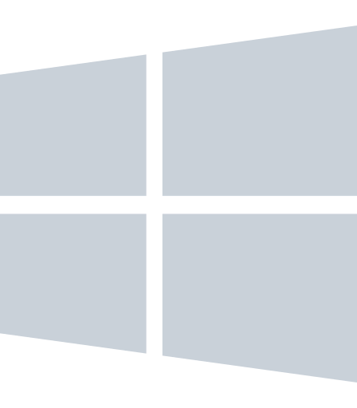

# ff0l

C++, Windows internals, reverse engineering, ImGui.

I build native UI and low-level tools.

 

&nbsp;&nbsp;&nbsp;

&nbsp;&nbsp;&nbsp;

&nbsp;&nbsp;&nbsp;

  

**C++** &nbsp;·&nbsp; **Win32** &nbsp;·&nbsp; **ImGui** &nbsp;·&nbsp; **reverse** &nbsp;·&nbsp; Discord `ff0l`

 

 

&nbsp;

 

  <a href="https://github.com/ff0l/roblox-dumper">roblox-dumper</a>
  &nbsp;·&nbsp;
  <a href="https://github.com/ff0l/eft-kd-dropper">eft-kd-dropper</a>

 

